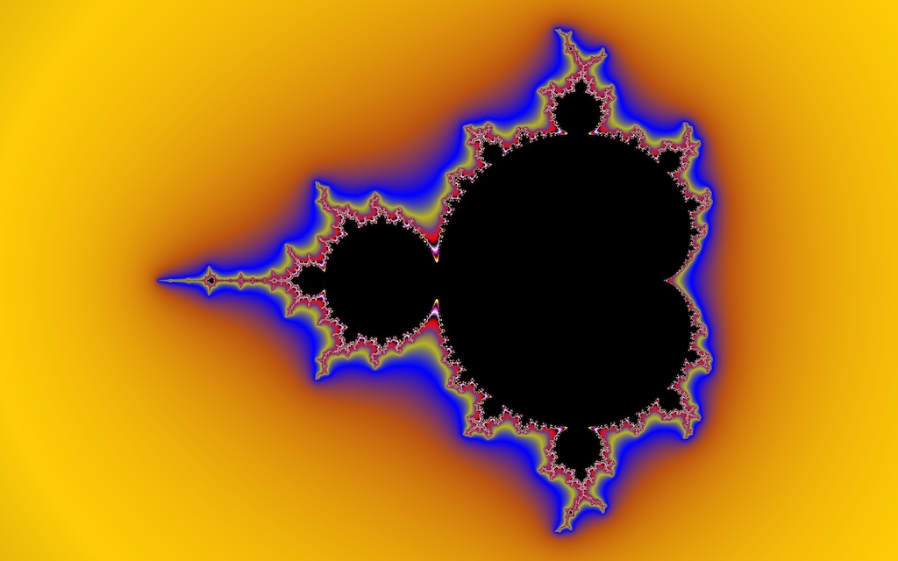
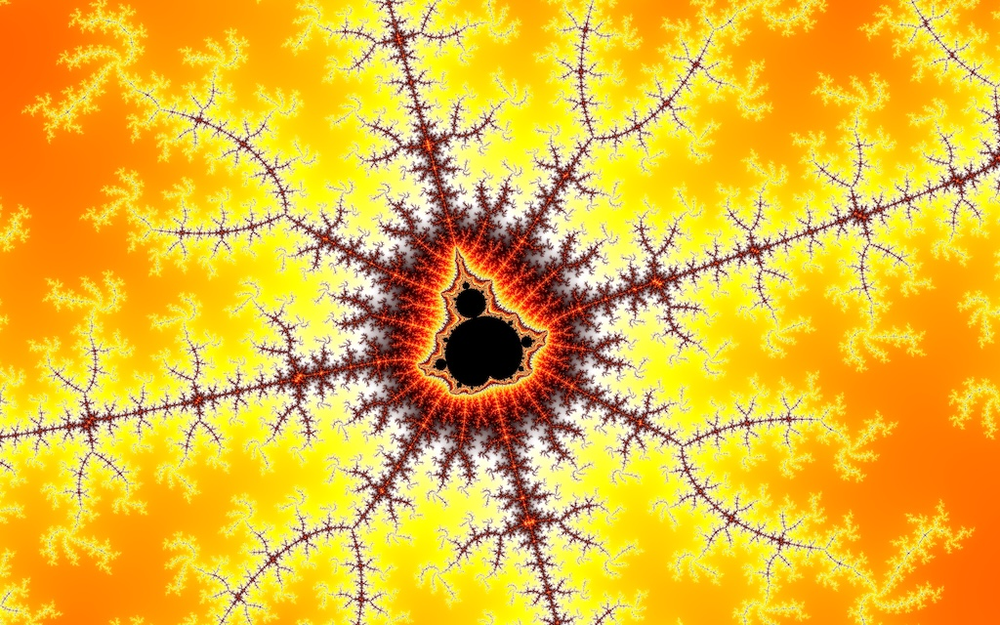
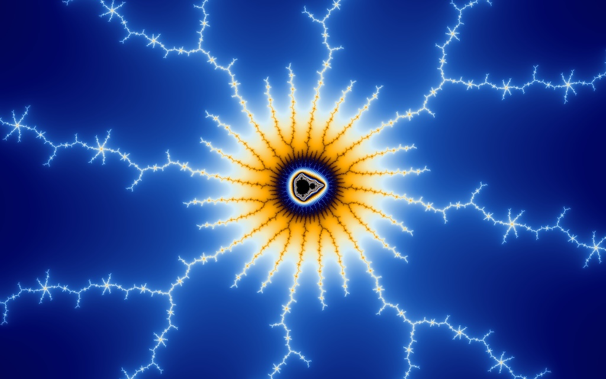
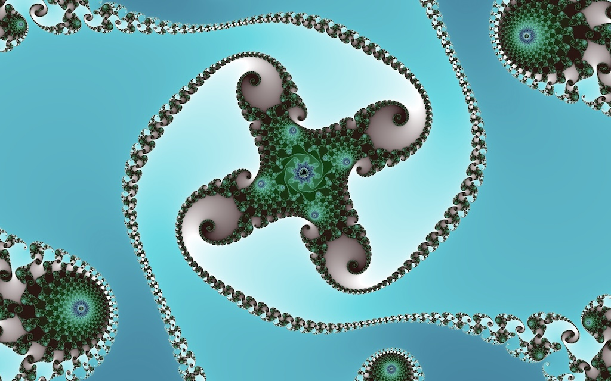

# go-fractgen

A fractal generator written in Go, as cli, library and web app.

This is a work in progress. The main goal is to have the full functionality (and more) as my previous
project [JFractGen](https://github.com/bylexus/JFractGen).

**Some Examples:**






## Features

- generate Mandelbrot and Julia fractals
- create fractals as png / jpeg
- start a web server for interactive usage in a Web application
- use a presets file to configure the fractal parameters and color palettes
- float64 precision

## Build

```bash
# Build the frontend:
npm run build
# build the backend:
go build -o fractgen
```

## Usage

### Help

```bash
# for global help and commands:
fractgen --help

# for a specific command:
fractgen [command] --help
```

### Start a web server

```bash
fractgen serve

# with a different port / IP binding:
fractgen serve --listen 127.0.0.1:8001
```

### Generate a single image

```bash
# to list all available options:
fractgen image --help 

# generate a Mandelbrot fractal image to "my-image.jpg" with a custom color palette and 1000 iterations:
fractgen image --max-iter=1000 --color-preset=red-alert my-image.jpg
```


### Create a flight (video/multi images) through a fractal

With the `flight` command, you can create a flight through a fractal from a start point to an end point.

```bash
go run main.go flight --duration 60 --fps 30 \
		--width=720 \
		--height=405 \
        --start-center-cx=1 \
        --start-center-cy=0 \
        --start-diameter-cx=3 \
        --end-center-cx=-0.736882432177663 \
        --end-center-cy=0.17482000150317034 \
        --end-diameter-cx=2.0116567611694336e-7 \
        --color-preset=patchwork \
        --palette-repeat=1 \
        --palette-length=-1 \
        --max-iter=1000 \
		output
```

This generates a series of images in the `output` folder. If you want to generate a video from the images, you can use `ffmpeg`:

```bash
ffmpeg -framerate 30 -pattern_type glob -i '*.jpeg' -c:v libx264 -pix_fmt yuv420p out.mp4
```

### Using presets

`fractgen` comes with a set of built-in color and fractal presets. To list the available presets, run:

```bash
fractgen presets
```

The presets are available in the Web UI, and you can use them with the image generation commands, e.g.:

```bash
fractgen image --fractal-preset="Mandelbrot Total" "mandelbrot_total.jpg"
```

#### Define your own presets

You can define your own presets in a JSON. The preset JSON's structure is as follows:

```json
{
  "colorPresets": [
    {
      "name": "Patchwork",
      "ident": "patchwork",
      "colors": [
        { "a": 255, "r": 0, "b": 30, "g": 0 },
        { "a": 255, "r": 253, "b": 6, "g": 204 },
        { "a": 255, "r": 186, "b": 15, "g": 84 }
      ]
    },
	// .....
  ],
  "fractalPresets": [
    {
      "maxIterations": 40,
      "diameterCX": 4,
      "colorPreset": "patchwork",
      "juliaKi": 0.6,
      "colorPaletteLength": -1,
      "iterFunc": "Mandelbrot",
      "name": "Mandelbrot Total",
      "colorPaletteRepeat": 1,
      "centerCY": 0,
      "centerCX": -0.7,
      "juliaKr": -0.6
    },
	// .....
  ]
}
```

The JSON file can be used with the `--presets-file` command line option, e.g.:

```bash
fractgen image --presets-file=presets.json --fractal-preset="Mandelbrot Total" "mandelbrot_total.jpg"
```


### TODOs

#### General

- [x] implement missing fractal functions (julia, mandelbrot ^ n, ...)
- [x] Embed default preset.json in binary (using go embed)
- [x] palette inversion (reverse order)
- [x] palette length: bound to max iter (done), or fixed length
- [ ] embed fract params in image metadata
- [ ] more coloring options:
  - [ ] orbit traps
- [x] Create fully self-contained binary, so that no external dependencies are required. The full web app should be
      embedded.

#### CLI

- [ ] create a cli app
	- [x] create a serve command to start a web server
	- [x] create an image command to generate a single image
	- [ ] create a movie command to generate a series of images / movie

- [ ] create movie / animation from start to end point / zoom level

#### Web app

- [x] Treat the fractal plane as grid: Create a grid-based approach to generate and cache the images,
using a Mapping library like OpenLayers to render the tiles. This allows for easy pre-generation and caching
of the fractal images as tiles.
- [ ] Caching of generated images, using wmts tiles from above, and the necessary metadata as key
- [x] zoom in/out with buttons
- [x] zoom in with double-click
- [x] zoom in with drag a rectangle
- [x] zoom in pinch zoom
- [ ] History / Undo stack
- [ ] fractal params in URL / as query params, instead of local storage
- [x] export fractal params as JSON
- [x] export fractal params as png / jpeg
- [ ] import function: import a preset / a color scheme
- [ ] palette editor


## Dev Notes

### Generate images from all presets at once:

```bash
IFS=$'\n' jq -r '.fractalPresets.[].name' presets.json | while read preset; do; \ 
	echo "Working on '${preset}'"; \
	./fractgen image \
		--fractal-preset="${preset}" \
		--width=3840 \
		--height=2400 \
		"output/${preset}.jpg"; \
done
```

### Watch frontend and serve it

The go webserver embeds the frontend files from `webroot/dist` on build time. During development, you can watch the frontend files and use a non-emedded version of the frontend:

```bash
shell1 $> npm run watch 
shell2 $>go run main.go serve --webroot=webroot/dist
```

### Some Flight examples

```bash
go run main.go flight --duration 60 --fps 60 \
		--width=1920 \
		--height=1080 \
        --start-center-cx=-0.7 \
        --start-center-cy=0 \
        --start-diameter-cx=3 \
        --end-center-cx=-0.736882432177663 \
        --end-center-cy=0.17482000150317034 \
        --end-diameter-cx=2.0116567611694336e-7 \
        --color-preset=patchwork \
        --palette-repeat=1 \
        --palette-length=-1 \
        --max-iter=1000 \
		output
```